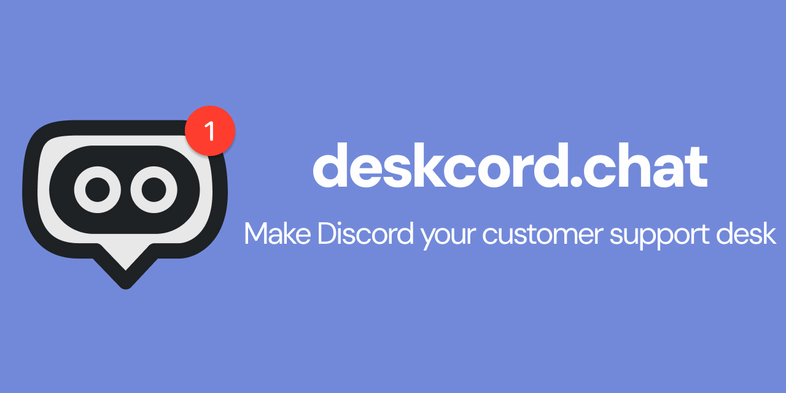

# Deskcord — Help Desk & Live Chat Widget for Discord



**Deskcord** is help desk software and a **live chat widget for Discord** that turns any Discord server into a full customer support platform. Instead of paying for expensive enterprise tools like Intercom, Zendesk, Freshdesk, Help Scout, Drift, Crisp, LiveChat, Olark, or Front, small teams and indie hackers can run **Discord-based customer support** for a flat $4.99–$19.99/month — with no per-seat pricing, no bloated dashboards, and no new tool to learn.

Add a **customer support widget** to your website, and every visitor conversation becomes a thread in your Discord server. Reply from Discord — desktop or mobile — and the customer sees your answer instantly in the widget on your site. No separate login, no new app, no email delays.

Deskcord is a **budget-friendly Zendesk competitor**, an **affordable alternative to Intercom**, and a **cheap support tool** built specifically for startups, solo founders, and small teams who want live chat software without enterprise overhead.

- 🌐 Website: [deskcord.chat](https://deskcord.chat?utm_source=github&utm_medium=docs)
- 📦 Widget npm package: [`deskcord`](https://www.npmjs.com/package/deskcord)
- 💬 Category: help desk software, live chat widget, customer service chat, website live chat

---

## Table of Contents

- [What is Deskcord?](#what-is-deskcord)
- [How It Works](#how-it-works)
- [Installing the Embed](#installing-the-embed)
- [Key Features](#key-features)
- [Why Discord for Customer Support?](#why-discord-for-customer-support)
- [Pricing](#pricing)
- [Discord Commands](#discord-commands)
- [FAQ](#faq)
- [Compare Deskcord to Other Help Desk Tools](#compare-deskcord-to-other-help-desk-tools)
- [Documentation](#documentation)

---

## What is Deskcord?

Deskcord turns Discord into your **customer support desk**. It's live chat software and help desk software in one, minus the complexity: a lightweight, embeddable **support widget** creates a private Discord thread for every customer conversation, and you (or your team) reply directly from Discord — on desktop, mobile, or wherever you already are.

There's no separate agent dashboard to log into, no per-seat billing that punishes you for growing your team, and no message data locked away in a proprietary system. Every conversation lives in **your own Discord server**, so if you ever cancel, you keep 100% of your conversation history.

Deskcord is deliberately **barebones by design** — it covers the essentials of live chat and help desk software (widget, threads, notifications, customization) without the bloat of enterprise "customer engagement platforms." That's what makes it a **genuine alternative for the giants like Intercom or Zendesk** for startups that don't want to pay enterprise prices for chat support software.

## How It Works

Setting up Deskcord's **live support chat** takes about 5 minutes:

1. **Add the bot to Discord** — authorize the Deskcord bot on your Discord server (1 minute).
2. **Subscribe and get your widget code** — run `/subscribe`, then `/setup` to generate your embed snippet (2 minutes).
3. **Install the embed on your website** — paste the script tag before `</body>` (1 minute).
4. **Start answering customers from Discord** — every new conversation shows up as a thread in your support channel, instantly.

When a customer sends a message through the **website live chat** widget, a new Discord thread appears in your designated support channel. Reply like you would to any Discord message — the customer sees your reply appear live in the widget, no page refresh needed.

## Installing the Embed

Installing the Deskcord **live chat widget** on your website is a copy-paste job — no build step, no SDK, no code required beyond a single `<script>` tag.

1. In your Discord server, run **`/setup`** to generate your unique embed snippet. This includes your server's `app_id`, which ties widget conversations back to your Discord server.
2. Paste the generated script tag into your site's HTML, right before the closing `</body>` tag, on every page where you want the **customer support widget** to appear:

   ```html
   <script>
     window.deskcord = {
       settings: {
         app_id: "YOUR_DISCORD_SERVER_ID",
       },
     };
   </script>
   <script src="https://cdn.deskcord.chat/deskcord.min.js"></script>
   ```

3. Save and deploy your site. The Deskcord chat bubble appears automatically in the bottom-right corner — no further configuration needed.

That's it — the widget is live, mobile-responsive, and ready to create Discord threads from real customer conversations. A few notes:

- **Unlimited domains, one subscription.** You can install the same embed code on every website or product you run and manage all of it from a single Discord server — there's no per-domain fee.
- **Customize the look.** Use `/customize-widget` in Discord to set your brand color, header text, branding, widget position (bottom-left or bottom-right), and the offline message shown when no one's around to reply — changes apply instantly, no redeploy required.
- **Lock it down (optional).** Use `/set-allowed-domains` to restrict which domains can load your widget code, so your embed can't be copy-pasted onto someone else's site. Local development domains (e.g. `localhost`) are always allowed automatically.
- **Framework-agnostic.** Because it's a plain script tag, the embed works the same way in static HTML, WordPress, Webflow, Next.js, React, Vue, Shopify, or any other stack — just drop it in your site's global layout or footer include.

Full command reference: [docs/commands.md](docs/commands.md).

## Key Features

- **Simple Widget** — embed in 30 seconds, customizable brand color, branding, and widget position, mobile-responsive, no code required beyond the embed snippet.
- **Discord Threads** — each customer gets their own thread, full conversation history, team member assignment, and one-click resolution.
- **Mobile-First** — answer support tickets from the Discord mobile app with push notifications out of the box; no separate login.
- **Privacy-First** — zero message content stored on Deskcord's servers; every conversation lives in your Discord server, built on Discord's own infrastructure.
- **Transparent Pricing** — flat monthly pricing, unlimited domains on every plan, no per-seat fees, cancel anytime, 7-day free trial.
- **Lightning-Fast Setup** — bot install, subscribe, embed, and you're answering customers in under 5 minutes.

## Why Discord for Customer Support?

Discord has evolved well beyond gaming into one of the best free team communication tools available — which is exactly why it works so well as **customer service chat** infrastructure:

- You (and likely your team) are already using it.
- The mobile app delivers instant push notifications with zero setup.
- Threads keep every conversation organized, the same way Slack threads do.
- It's free forever — no per-user fees like Slack or Microsoft Teams paid tiers.
- Your data stays with you — conversations aren't locked inside expensive, proprietary SaaS.

| Feature            | Discord               | Slack               | Teams         |
| ------------------ | --------------------- | ------------------- | ------------- |
| Price              | Free forever          | $8/user/month       | $4/user/month |
| Message history    | Unlimited             | 90 days (free tier) | Limited       |
| Threads            | Built-in, clean       | Available           | Available     |
| Mobile experience  | Excellent             | Good                | Okay          |
| Voice/Video        | Included              | Paid tier           | Included      |
| Already installed? | Likely (personal use) | Needs setup         | Needs setup   |

## Pricing

All plans include a 7-day free trial, unlimited domains, and unlimited conversations. Cancel anytime.

| Plan     | Monthly   | Yearly (per month)            | Best for                                                  |
| -------- | --------- | ----------------------------- | --------------------------------------------------------- |
| **Solo** | $4.99/mo  | $4/mo (billed $49/yr)         | Solo founders and indie hackers running multiple products |
| **Team** | $19.99/mo | $16/mo (billed $190/yr)       | Small teams who need more than one person replying        |

Compared to typical **help desk software** and **live chat software** pricing:

- **Intercom**: from $39/seat (2-seat minimum = $78/month; most teams pay $500+/month).
- **Zendesk**: from $55/agent/month ($165/month for a 3-agent team).
- **Crisp**: $25/workspace/month, often $50+/month once you need multiple workspaces.
- **Help Scout**: per-user pricing that scales with team size.
- **Deskcord Team**: a flat **$19.99/month (annual)** for unlimited agents and unlimited domains.

## Discord Commands

Deskcord is configured entirely through Discord slash commands — no external admin dashboard to learn:

| Command                    | Description                                                                          |
| -------------------------- | ------------------------------------------------------------------------------------ |
| `/subscribe`               | Start your Solo or Team subscription (7-day free trial, no card required to preview) |
| `/setup`                   | Generate your website embed code                                                     |
| `/set-destination-channel` | Choose which Discord channel receives new customer threads                           |
| `/manage-subscription`     | Open the Stripe customer portal to upgrade, downgrade, or cancel                     |
| `/set-main-cs-member`      | Assign the single support seat on the Solo plan                                      |
| `/resolve-conversation`    | Mark a customer thread as resolved and archive it                                    |
| `/customize-widget`        | Set your widget's brand color, header text, branding, widget position, and offline message |
| `/set-allowed-domains`     | Restrict which domains may load your widget embed                                    |

Full details and usage examples: [docs/commands.md](docs/commands.md).

## FAQ

**How do I install Deskcord?** Add the bot to Discord, run `/subscribe`, then `/setup` to get your embed code, and paste it into your site before `</body>`. See [Installing the Embed](#installing-the-embed).

**Is my customer data secure?** Yes — no message content is stored on Deskcord's servers. Every conversation lives in your own Discord server, which handles infrastructure, encryption, and compliance.

**Do customers need a Discord account?** No. Customers interact entirely through the website widget and never see Discord.

**Can I install the widget on more than one website?** Yes, on every plan, at no extra cost — unlimited domains from a single Discord server and subscription.

**What happens if I cancel?** Your Discord server and full conversation history stay with you forever; you only lose the widget on your website.

More questions answered in [docs/faq.md](docs/faq.md).

## Compare Deskcord to Other Help Desk Tools

Deskcord is built as an affordable, Discord-native alternative to the major players in live chat and help desk software:

- [Deskcord vs Intercom](https://deskcord.chat/alternative/intercom?utm_source=github&utm_medium=docs) — Intercom alternative and Intercom replacement for startups
- [Deskcord vs Zendesk](https://deskcord.chat/alternative/zendesk?utm_source=github&utm_medium=docs) — Zendesk alternative without the per-agent pricing
- [Deskcord vs Crisp](https://deskcord.chat/alternative/crisp?utm_source=github&utm_medium=docs) — Crisp alternative with native Discord integration
- [Deskcord vs Help Scout / HelpCrunch](https://deskcord.chat/alternative/helpcrunch?utm_source=github&utm_medium=docs) — Help Scout alternative with unlimited team members

## Documentation

- [Installation](docs/installation.md) — detailed embed setup, framework examples, and troubleshooting
- [Discord Commands](docs/commands.md) — full slash command reference
- [Pricing](docs/pricing.md) — plans, billing, and competitor cost comparisons
- [Why Discord](docs/why-discord.md) — why Discord works as customer service chat infrastructure
- [FAQ](docs/faq.md) — the full frequently-asked-questions list
- [Comparisons](docs/comparisons/) — Deskcord vs Intercom, Zendesk, Crisp, and HelpCrunch

---

_Deskcord — customer support software built for Discord. [deskcord.chat](https://deskcord.chat?utm_source=github&utm_medium=docs)_
